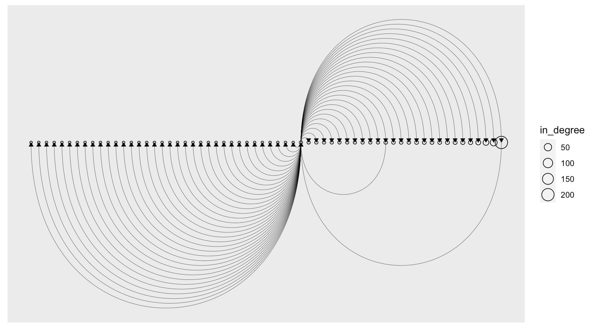

[](https://www.repostatus.org/#active)
[](https://keybase.io/hrbrmstr)

[](https://travis-ci.org/hrbrmstr/brimr)  


# brimr

Tools to Work with Brim and zqd

## Description

Brim (<https://github.com/brimsec/brim>) enables efficient query
operations on large packet captures and log sources, such as Zeek. Tools
are provided to with with Brim components, including the Brim zqd query
back-end.

## What’s Inside The Tin

The following functions are implemented:

-   `brim_ast`: Turn a Brim ZQL query into an abstract syntax tree
-   `brim_host`: Retrieve the Brim host URL
-   `brim_search_raw`: Post a ZQL query to the given Brim instance and
    retrieve results in raq ZJSON format
-   `brim_search`: Post a ZQL query to the given Brim instance and
    retrieve processed results
-   `brim_spaces`: Retrieve active Brim spaces from the specified Brim
    instance
-   `tidy_brim`: Turn Brim/zqd search results into a data frame
-   `zq_cmd`: Execute a zq command line

## Installation

``` r
remotes::install_git("https://git.rud.is/hrbrmstr/brimr.git")
# or
remotes::install_gitlab("hrbrmstr/brimr")
# or
remotes::install_bitbucket("hrbrmstr/brimr")
# or
remotes::install_github("hrbrmstr/brimr")
```

NOTE: To use the ‘remotes’ install options you will need to have the
[{remotes} package](https://github.com/r-lib/remotes) installed.

## Usage

``` r
library(brimr)
library(tibble)

# current version
packageVersion("brimr")
## [1] '0.1.0'
```

### Available Brim “spaces”

``` r
brim_spaces()
##                               id                                                            name
## 1 sp_1p6pwLgtsESYBTHU9PL9fcl2iBn 2021-02-17-Trickbot-gtag-rob13-infection-in-AD-environment.pcap
##                                                                                              data_path storage_kind
## 1 file:///Users/hrbrmstr/Library/Application%20Support/Brim/data/spaces/sp_1p6pwLgtsESYBTHU9PL9fcl2iBn    filestore
```

### Sample ZQL query

``` r
# Z query to fetch Zeek connection data to create our network connection graph
zql1 <- '_path=conn | count() by id.orig_h, id.resp_h, id.resp_p | sort id.orig_h, id.resp_h, id.resp_p'

cat(
  substr(jsonlite::toJSON(jsonlite::fromJSON(brim_ast(zql1)), pretty = TRUE), 1, 100), "..."
)
## {
##   "op": ["SequentialProc"],
##   "procs": [
##     {
##       "op": "FilterProc",
##       "filter": {
##         ...
```

### Let’s execute the query

``` r
space <- "2021-02-17-Trickbot-gtag-rob13-infection-in-AD-environment.pcap"

r1 <- brim_search(space, zql1)

r1
## ZQL query took 0.0000 seconds; 384 records matched; 1,082 records read; 238,052 bytes read

(r1 <- as_tibble(tidy_brim(r1)))
## # A tibble: 74 x 4
##    orig_h      resp_h       resp_p count
##    <chr>       <chr>        <chr>  <int>
##  1 10.2.17.2   10.2.17.101  49787      1
##  2 10.2.17.101 3.222.126.94 80         1
##  3 10.2.17.101 10.2.17.1    445        1
##  4 10.2.17.101 10.2.17.2    53        97
##  5 10.2.17.101 10.2.17.2    88        27
##  6 10.2.17.101 10.2.17.2    123        5
##  7 10.2.17.101 10.2.17.2    135        8
##  8 10.2.17.101 10.2.17.2    137        2
##  9 10.2.17.101 10.2.17.2    138        2
## 10 10.2.17.101 10.2.17.2    389       37
## # … with 64 more rows
```

### Let’s try one that processes the Suricata alerts

``` r
# Z query to fetch Suricata alerts including the count of alerts per source:destination 
zql2 <- "event_type=alert | count() by src_ip, dest_ip, dest_port, alert.severity, alert.signature | sort src_ip, dest_ip, dest_port, alert.severity, alert.signature"

r2 <- brim_search(space, zql2)

r2
## ZQL query took 0.0000 seconds; 47 records matched; 870 records read; 238,660 bytes read

(r2 <- (as_tibble(tidy_brim(r2))))
## # A tibble: 35 x 6
##    src_ip     dest_ip    dest_port severity signature                                                              count
##    <chr>      <chr>          <int>    <int> <chr>                                                                  <int>
##  1 10.2.17.2  10.2.17.1…     49674        3 SURICATA Applayer Detect protocol only one direction                       1
##  2 10.2.17.2  10.2.17.1…     49680        3 SURICATA Applayer Detect protocol only one direction                       1
##  3 10.2.17.2  10.2.17.1…     49687        3 SURICATA Applayer Detect protocol only one direction                       1
##  4 10.2.17.2  10.2.17.1…     49704        3 SURICATA Applayer Detect protocol only one direction                       1
##  5 10.2.17.2  10.2.17.1…     49709        3 SURICATA Applayer Detect protocol only one direction                       1
##  6 10.2.17.2  10.2.17.1…     49721        3 SURICATA Applayer Detect protocol only one direction                       1
##  7 10.2.17.2  10.2.17.1…     50126        3 SURICATA Applayer Detect protocol only one direction                       1
##  8 10.2.17.1… 3.222.126…        80        2 ET POLICY curl User-Agent Outbound                                         1
##  9 10.2.17.1… 36.95.27.…       443        1 ET HUNTING Suspicious POST with Common Windows Process Names - Possib…     1
## 10 10.2.17.1… 36.95.27.…       443        1 ET MALWARE Win32/Trickbot Data Exfiltration                                1
## # … with 25 more rows
```

``` r
library(igraph)
library(ggraph)
library(tidyverse)

gdf <- count(r1, orig_h, resp_h, wt=count)

count(gdf, node = resp_h, wt=n, name = "in_degree") %>% 
  full_join(
    count(gdf, node = orig_h, name = "out_degree")
  ) %>% 
  mutate_at(
    vars(in_degree, out_degree),
    replace_na, 1
  ) %>% 
  arrange(in_degree) -> vdf

g <- graph_from_data_frame(gdf, vertices = vdf)

ggraph(g, layout = "linear") +
  geom_node_point(
    aes(size = in_degree), shape = 21
  ) +
  geom_edge_arc(
    width = 0.125, 
    arrow = arrow(
      length = unit(5, "pt"),
      type = "closed"
    )
  )
```



### Use `zq` directly

``` r
zq_cmd(
  c(
    '"* | cut ts,id.orig_h,id.orig_p"', # note the quotes
    system.file("logs", "conn.log.gz", package = "brimr")
   )
 )
##           id.orig_h id.orig_p                          ts
##   1:  10.164.94.120     39681 2018-03-24T17:15:21.255387Z
##   2:    10.47.25.80     50817 2018-03-24T17:15:21.411148Z
##   3:    10.47.25.80     50817 2018-03-24T17:15:21.926018Z
##   4:    10.47.25.80     50813 2018-03-24T17:15:22.690601Z
##   5:    10.47.25.80     50813 2018-03-24T17:15:23.205187Z
##  ---                                                     
## 988: 10.174.251.215     33003 2018-03-24T17:15:21.429238Z
## 989: 10.174.251.215     33003 2018-03-24T17:15:21.429315Z
## 990: 10.174.251.215     33003 2018-03-24T17:15:21.429479Z
## 991:  10.164.94.120     38265 2018-03-24T17:15:21.427375Z
## 992: 10.174.251.215     33003 2018-03-24T17:15:21.433306Z
```

## brimr Metrics

| Lang | \# Files |  (%) | LoC |  (%) | Blank lines |  (%) | \# Lines |  (%) |
|:-----|---------:|-----:|----:|-----:|------------:|-----:|---------:|-----:|
| R    |        5 | 0.42 | 180 | 0.39 |          71 | 0.33 |       86 | 0.32 |
| Rmd  |        1 | 0.08 |  53 | 0.11 |          37 | 0.17 |       47 | 0.18 |
| SUM  |        6 | 0.50 | 233 | 0.50 |         108 | 0.50 |      133 | 0.50 |

clock Package Metrics for brimr

## Code of Conduct

Please note that this project is released with a Contributor Code of
Conduct. By participating in this project you agree to abide by its
terms.
